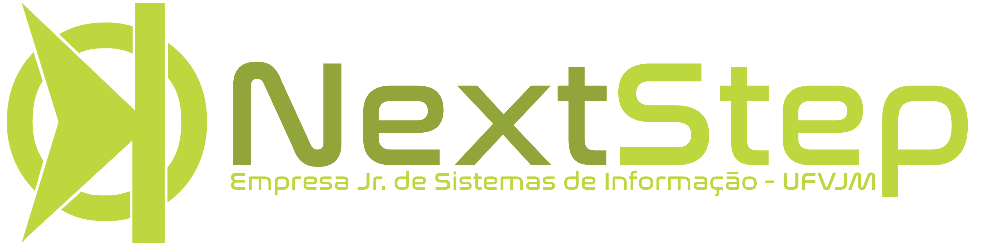

# Treinamento Web Avançado Next Step - 2017/1
## Projeto Pratico - Agenda de Contatos
> Este projeto tem como finalizada colocar em pratica os conceitos basicos de PHP e serviçõs Web. Objetivo do projeto é abordar varias conceitos a respeito de PHP e afins.

Principal objetivo deste projeto é mostrar os conceitos apresentados na disciplina.

Neste projeto não é seguido as boas praticas de programação visto que sem as boas praticas o projeto se tornam mais didatico para apresentar alguns conceitos basicos. 

Ãplicações como Cadastro de Usuários é feita de maneira não recomendada. As demais funcionalidades do sistema requisitam uma API feita em PHP para servir dados.

### Clonando o projeto e instalando dependencias
Entre no diretorio que deseja clonar o projeto, e execute o comando do git.

    git clone https://github.com/LFelipeEB/tagenda tAgenda
    
Assim foi criado um pasta chamanda `tAgenda`. Agora falta instalar as dependencias do repositorio com o composer.

1. Entre no diretorio do projeto

        cd tAgenda
    
1. Instale o `Composer`
    
        curl -sS https://getcomposer.org/installer | php
        
1. Instaler as dependencias pelo `Composer`

        composer.phar install
        
 1. É necesssario ter instalado o NPM, para gerenciar as dependencias
 
        npm install
        
        
### Criando o banco de dados
Para simplificar e evitar erros durante a criação de banco de dados, o projeto esta utilizando o modulo PHINX, o mesmo utilizado no framework CakePHP. Após a instalação das dependencias do Composer o Phin irá funcionar corretamente.

1. Inicie o Phinx
    
        vendor/bin/phinx init

1. Execute a migração das tabelas

        vendor/bin/phinx migrate
        
1. Faça uma população dos dados com o seed.

        vendor/bin/phinx seed
        
### Configurando o Banco de Dados
Para configurar o Banco de Dados crie um arquivo chamado `database.ini`. Este arquivo deve ter configuraado as varaiveis de conexão do Banco de Dados. Cada variavel deve ser separado em uma linha, sendo elas :
>host=

>dbname=

>usurio=

>senha=

### Abrindo o servidor
Para evitar problemas com rotas e melhor depuração do servidor execute-o como servidor PHP.

    php -S localhost:8080 index.php

### Tools

- [Awsome README](https://github.com/sindresorhus/awesome): Utilizado para construir este README.
- [Atom](https://atom.io): IDE para desenvolvimento.
- [PHPStorm](https://www.jetbrains.com/phpstorm/): IDE para desenvolvimento.
- [NPM](https://npmjs.com): Gerenciador de repositorio JavaScript.
- [COMPOSER](https://getcomposer.org): Gerenciador de repositorio PHP
- [PHINX](https://phinx.org)

### Contribute

- [Luiz Felipe Evaristo](https://github.com/LFelipeEB)

### License

The MIT License (MIT) 

Copyright (c) 2017 

 Permission is hereby granted, free of charge, to any person obtaining a copy of this software and associated documentation files (the "Software"), to deal in the Software without restriction, including without limitation the rights to use, copy, modify, merge, publish, distribute, sublicense, and/or sell copies of the Software, and to permit persons to whom the Software is furnished to do so, subject to the following conditions: 

 The above copyright notice and this permission notice shall be included in all copies or substantial portions of the Software. 

 THE SOFTWARE IS PROVIDED "AS IS", WITHOUT WARRANTY OF ANY KIND, EXPRESS OR IMPLIED, INCLUDING BUT NOT LIMITED TO THE WARRANTIES OF MERCHANTABILITY, FITNESS FOR A PARTICULAR PURPOSE AND NONINFRINGEMENT. IN NO EVENT SHALL THE AUTHORS OR COPYRIGHT HOLDERS BE LIABLE FOR ANY CLAIM, DAMAGES OR OTHER LIABILITY, WHETHER IN AN ACTION OF CONTRACT, TORT OR OTHERWISE, ARISING FROM, OUT OF OR IN CONNECTION WITH THE SOFTWARE OR THE USE OR OTHER DEALINGS IN THE SOFTWARE. 
